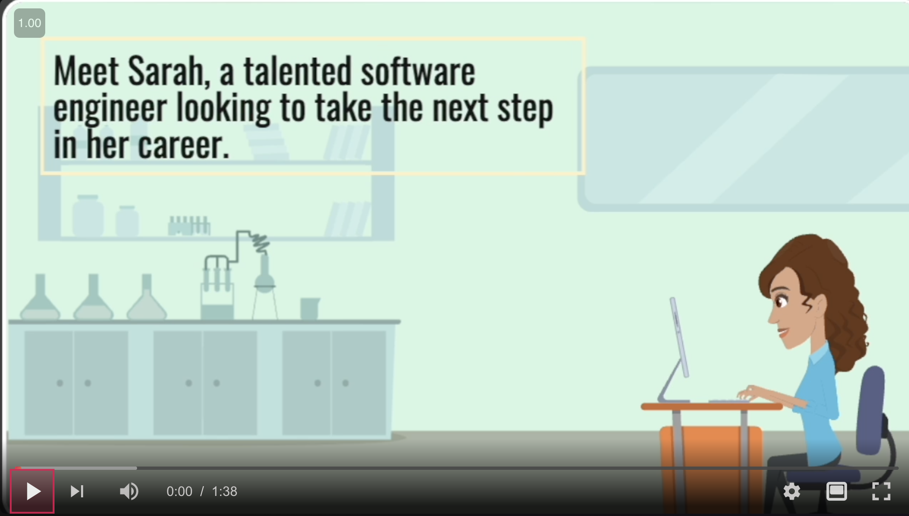
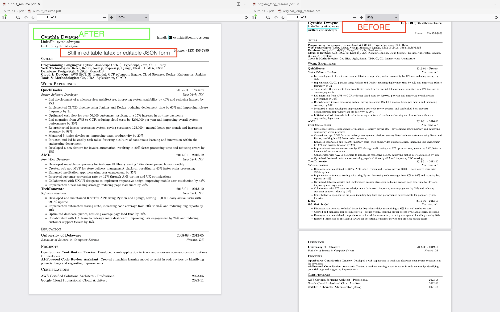
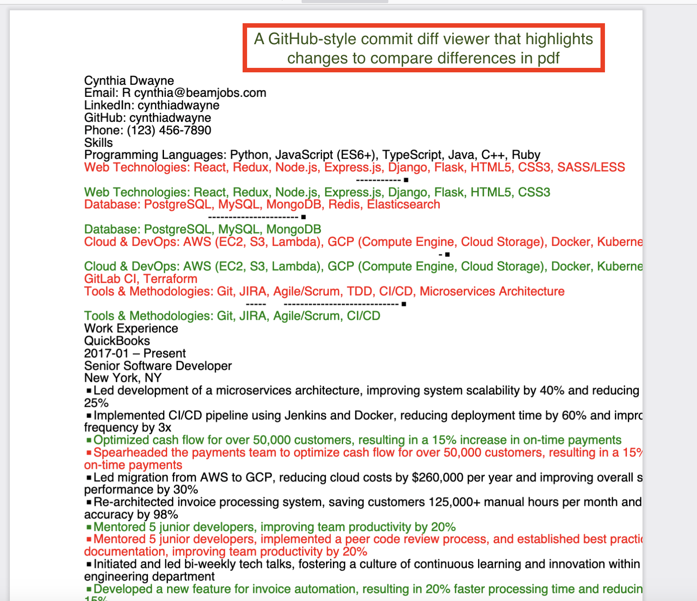

# CV Agents


[](https://odysee.com/$/embed/@rushi:2/cv-agents-final:1)


Introducing CV Agents, your personal career advancement team powered by artificial intelligence.

Imagine having a top hiring manager, an expert CV editor, and a savvy job seeker working tirelessly to perfect your CV. That's exactly what CV Agents does!

The AI-driven system takes your initial CV and runs it through a series of intelligent agents. The hiring manager evaluates it critically, the CV editor refines and optimizes it, and the job seeker strategizes to make it stand out. This process repeats until your CV achieves a top-tier rating.

CV Agents doesn't just edit; it transforms your CV into a powerful tool that showcases your skills and experiences in the best possible light. It ensures your CV fits on one page, highlights your most relevant qualifications, and aligns perfectly with job requirements.

Key advantages of CV Agents:

1. **Open-source**: The entire system is open-source, allowing for community contributions and transparency.

2. **Fully customizable**: Supports LaTeX and JSON formats, giving you complete control over the output.

3. **No ecosystem lock-in**: Unlike proprietary apps, CV Agents doesn't trap you in a closed ecosystem.

4. **No fake stories**: The AI doesn't invent fake stories or experiences. Instead, it selects and enhances your best real-life experiences.

5. **Resume optimization**: CV Agents carefully tweaks your resume to highlight your strengths and match job requirements.

6. **Smart selection**: If you have an extensive list of experiences or projects, CV Agents intelligently selects the most relevant ones for the job you're applying to, ensuring your CV remains impactful and concise.

Let AI revolutionize your job search and open doors to your dream career!

## Video

## Screenshots 

### Before vs After



### GitHub style commit diff




## Setup Instructions

1. **Job Description**: 
   - Paste the job description into `job_desc.txt` in the `data` directory.

2. **Resume JSON**:
   - Edit the `resume.json` in the `data` directory.
   - Use the following template format to generate your resume JSON from ChatGPT:
     ```json
     {
       "basics": {
         "name": "Your Name",
         "label": "Your Job Title",
         "email": "your.email@example.com",
         "phone": "123-456-7890",
         "url": "http://yourwebsite.com",
         "summary": "A brief summary about yourself.",
         "location": {
           "city": "Your City",
           "countryCode": "Your Country Code",
           "region": "Your Region"
         },
         "profiles": [
           {
             "network": "LinkedIn",
             "username": "yourusername",
             "url": "http://linkedin.com/in/yourusername"
           }
         ]
       },
       "work": [
         {
           "name": "Company Name",
           "position": "Your Position",
           "location": "Company Location",
           "startDate": "YYYY-MM-DD",
           "endDate": "YYYY-MM-DD",
           "highlights": ["Achievement 1", "Achievement 2"]
         }
       ],
       "education": [
         {
           "institution": "Your Institution",
           "area": "Your Area of Study",
           "studyType": "Degree Type",
           "location": "Institution Location",
           "startDate": "YYYY-MM-DD",
           "endDate": "YYYY-MM-DD",
           "gpa": "Your GPA",
           "courses": ["Course 1", "Course 2"]
         }
       ],
       "skills": [
         {
           "name": "Skill Name",
           "keywords": ["Keyword 1", "Keyword 2"]
         }
       ],
       "certificates": [
         {
           "name": "Certificate Name",
           "issuer": "Issuer Name",
           "date": "YYYY-MM-DD"
         }
       ],
       "projects": [
         {
           "name": "Project Name",
           "description": "Project Description",
           "highlights": ["Highlight 1", "Highlight 2"],
           "keywords": ["Keyword 1", "Keyword 2"],
           "url": "http://projecturl.com"
         }
       ],
       "languages": [
         {
           "language": "Language Name",
           "fluency": "Fluency Level"
         }
       ],
       "interests": [
         {
           "name": "Interest Name",
           "keywords": ["Keyword 1", "Keyword 2"]
         }
       ]
     }
     ```

3. **Agent Prompts**:
   - The agent prompts are stored in `prompts/job_application_prompts.py`.
   - Feel free to edit those prompts for better results based on your specific needs.

4. **Generate PDF**:
   - To see how your `resume.json` looks as a PDF, run:
     ```bash
     python resume/generator.py
     ```
   - The generated PDFs will be stored in the `outputs/pdf` directory, and their corresponding LaTeX files will be in `outputs/latex/`.

5. **Rename PDF**:
   - Rename the generated `output_resume.pdf` to `original_long_resume.pdf` and keep it in the `outputs/pdf` directory for later comparison.

6. **Run the Agents**:
   - Kick off the agents by running:
     ```bash
     python main.py
     ```
   - The agent will write the output to `outputs/pdf/output_resume.pdf`.

7. **Compare Resumes**:
   - You can manually compare the two resumes or run:
     ```bash
     python src/scripts/run_compare_pdf.py
     ```
   - This will generate a comparison PDF `outputs/pdf/compare_diff.pdf` of the two resumes.


## Contribution

If you find this project helpful, please star this repository and consider contributing by submitting pull requests. Your contributions can help improve the project for everyone!

